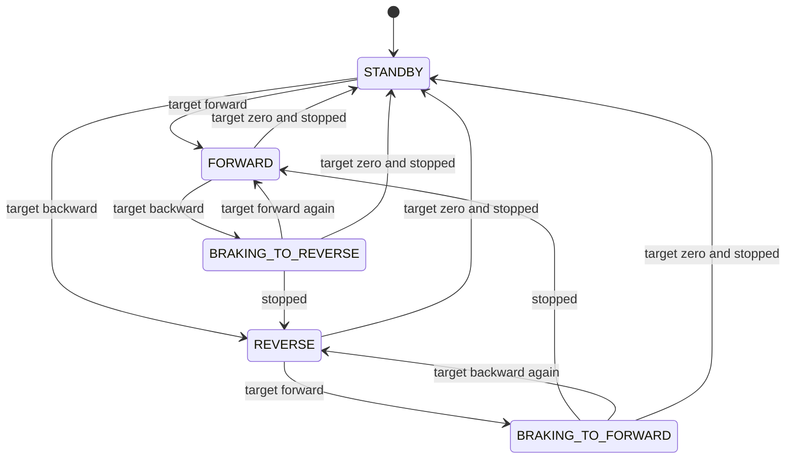

# nift_control

This package is the control layer of the NiFT autonomy stack. So far only its drive-by-wire interface is published. The trajectory controller, the speed controller and the safety filters will follow.

## dbw_interface

`dbw_interface` is the only code in the stack that knows the shuttle's CAN wire format. The rest of the stack passes it gear, brake, pedal and steering values, and gets back `can_msgs/Frame` messages that are ready to send.

### CAN frames

| ID | Length | Purpose | Bytes |
|---|---|---|---|
| `0x101` | 5 | Drive command | gear, brake, pedal, steering low byte, steering high byte |
| `0x100` | 1 | Emergency stop | 1 requests the E-stop, 0 means no E-stop |

- **Gear:** 0 is neutral, 1 is forward, 2 is reverse.
- **Brake and pedal:** 0 to 255.
- **Steering:** the angle in degrees times 100, plus 1500, sent low byte first. The angle range is −15° to +15°, so the value runs from 0 to 3000. For example, +5.18° becomes 2018, which goes on the wire as `E2 07`.

The encoder clips inputs that are out of range and logs a warning. If a command asks for pedal and brake at the same time, the brake wins and the pedal is set to 0. An engaged E-stop on the shuttle can only be cleared by cycling its power, so sending 0 on `0x100` does not release it.

The decoders do the reverse. The CARLA simulation uses them in its virtual ECU, so the simulated shuttle reads the same frames as the real one.

### Vehicle bridge

`NiftVehicleBridge` turns the speed controller's output `u` into gear, brake and throttle. `u` runs from −255 to 255. A state machine makes sure the shuttle never changes direction while it is still rolling. "Moving forward" below means a target speed above the zero-speed tolerance of 0.1 m/s, and "stopped" means a measured speed within it.



| State | Gear | Output |
|---|---|---|
| `STANDBY` | neutral | brake at least 50 |
| `FORWARD` | forward | throttle when `u` > 0, otherwise brake |
| `BRAKING_TO_REVERSE` | forward | brake at least 50 |
| `REVERSE` | reverse | throttle when `u` < 0, otherwise brake |
| `BRAKING_TO_FORWARD` | reverse | brake at least 50 |

Throttle and brake are never both above zero.

## Tests

```bash
colcon test --packages-select nift_control && colcon test-result --verbose
```

`test/test_can_interface.py` pins the wire format to fixed expected bytes. It also checks that every gear, brake and pedal value survives an encode and decode round trip, and it sweeps the full steering range. The flake8 and pep257 style checks run too.
